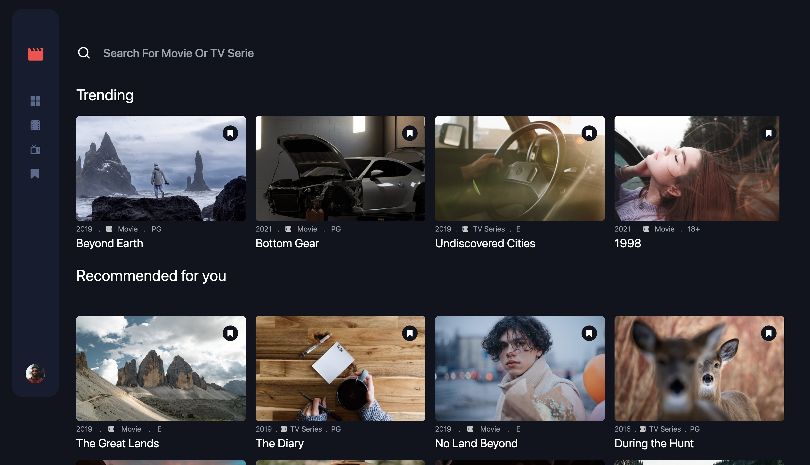
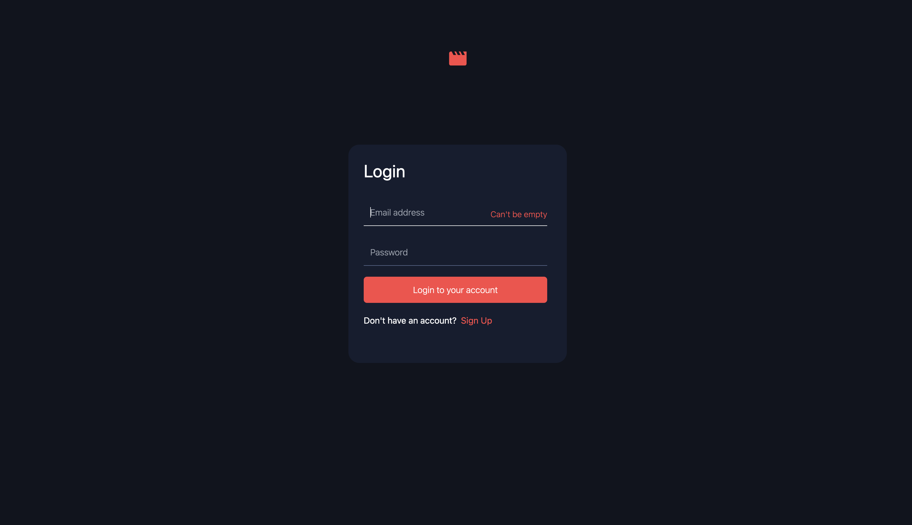
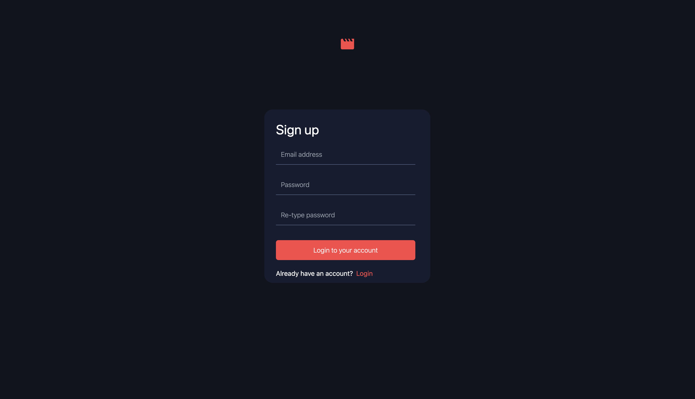

# Frontend Mentor - Entertainment web app solution

This is a solution to the [Entertainment web app challenge on Frontend Mentor](https://www.frontendmentor.io/challenges/entertainment-web-app-J-UhgAW1X). Frontend Mentor challenges help you improve your coding skills by building realistic project.

## Table of contents

- [Overview](#overview)
  - [The challenge](#the-challenge)
  - [Screenshot](#screenshot)
  - [Links](#links)
- [My process](#my-process)
  - [Built with](#built-with)
  - [What I learned](#what-i-learned)
  - [Continued development](#continued-development)
  - [Useful resources](#useful-resources)
- [Author](#author)
  
## Overview

### The challenge

Users should be able to:

- View the optimal layout for the app depending on their device's screen size
- See hover states for all interactive elements on the page
- Navigate between Home, Movies, TV Series, and Bookmarked Shows pages
- Add/Remove bookmarks from all movies and TV series
- Search for relevant shows on all pages
- *Bonus-Login and signup functionality

### Screenshot





### Links

- Live Site URL: [rwamugema.netlify.app](https://rwamugemajaphet.netlify.app/)

## My process

### Built with
- [Angular](https://angular.io/)
- [NGRX](https://ngrx.io/) - For state management
- [TailwindCss](https://tailwindcss.com/) - For styles

### What I learned

I have learned working with lazy loading and modularization of angular components

```
const routes: Routes = [
  {
    path: '', loadChildren:() => import('./modules/user.module').then(module => module.UserModule)
  },
  {
    path:'posts', loadChildren:() => import('./modules/movie.module').then(module => module.MovieModule)
  }
];
```

### Continued development
- Angular unit testing
- ngrx/data

### Useful resources

- [ngrx](https://ngrx.io/docs) - The documentation on this site is very well explained and easy to understand. I really liked this pattern and will use it going forward.
- [angular](https://angular.io/docs) - The docs on the site provide great overview of what you need to know to start with angular. I'd recommend it to anyone still learning this concept.


## Author

- Github - [Rwamugema](https://github.com/rwamugema)
